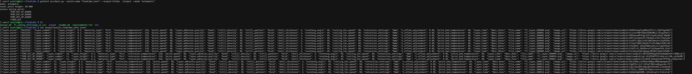
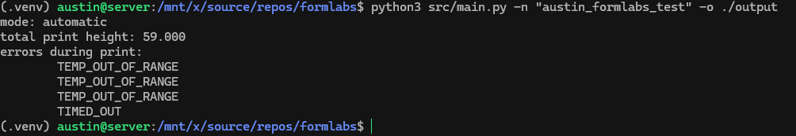
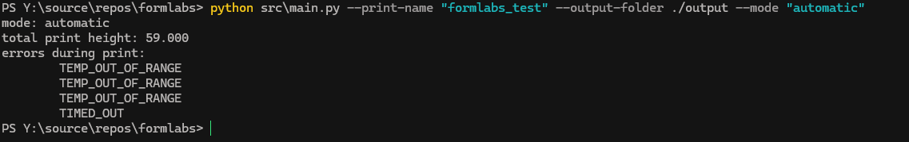

I got this running on Windows, Ubuntu, and my Raspberry Pi 4b. I don't have a Pi CM4 like the spec says, but I figured this would be a solid test. I've attached a screenshot of it running on the Pi below:

### Raspberry Pi 4b

### Ubuntu:

### Windows:

I SSH'd into each machine (aside from Windows) to run each test. The code lives in network storage, so each computer has easy access.

If I had more time I would do a real stress-test on my Pi 3b+ (the slowest Pi I have). Oh well!